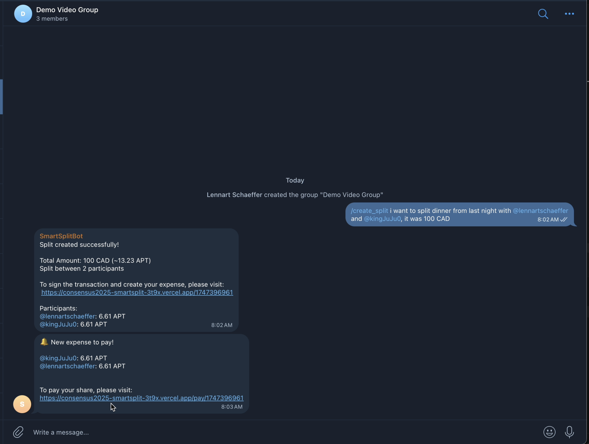
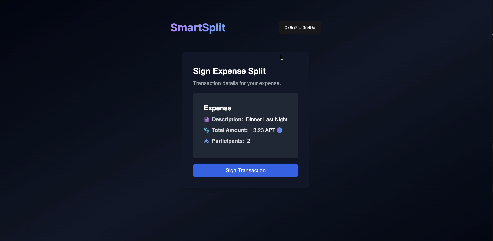
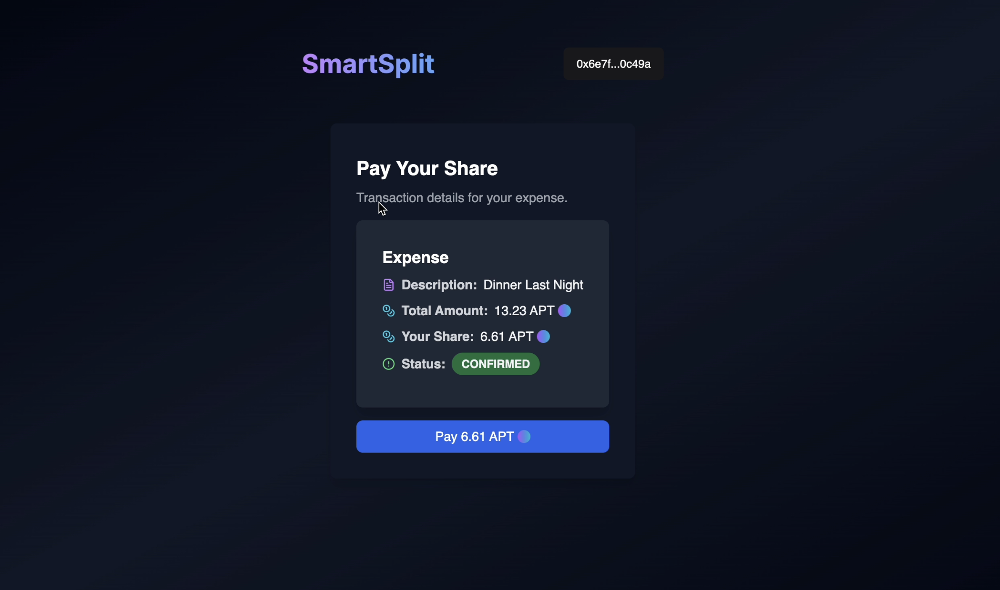
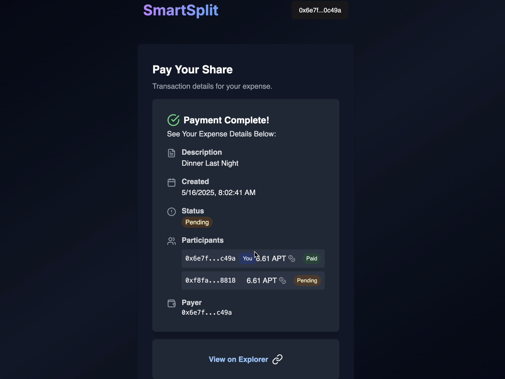

# SmartSplit

## Overview

SmartSplit is a Telegram bot that makes splitting group expenses as natural as having a conversation. Simply describe your expense in plain English in your group chat, and the bot handles the rest, from parsing the details to managing secure payments on the Aptos blockchain.g.

---

## How the Flow Works

1. **Connect Wallet (Telegram Bot)**
   - Before creating splits, users need to connect their Aptos wallet to their Telegram account
   - Users send `/connect` to the bot with their public wallet address
   - This creates a mapping between their Telegram username and their Aptos wallet address, so other group members can easily mention them and create a transaction
   - Used for validation when users sign their transactions
   - Once connected, users can participate in splits in any group where the bot is present

2. **Create a Split (Telegram Bot)**
   - A user initiates a split in a Telegram group by sending a command and a natural language explanation of the expense (e.g., `/create_split 100 CAD for dinner last night with @alice and @bob`).
   - The bot parses the message, uses AI to extract the amount, currency, and description, and checks that all users have connected their wallets.

3. **Expense Creation**
   - The bot generates a unique expense and stores it in the backend, allowing the frontend dApp to quickly pull expense details when signing a transaction.
   - A message is sent to the group chat with an expense summary, and a link for the creator to sign the transaction and create the expense on-chain.

4. **Signing the Expense (dApp)**
   - The expense creator visits the dApp link, connects their Aptos wallet, and signs a transaction to create the expense on-chain. 
   - The telegram bot sends out a new message, tagging participants of the expense and specifying the amount to pay in APT, and a link for them to pay their share

5. **Paying a Share**
   - Each participant connects their wallet and pays their share directly through the dApp.
   - The dApp updates the payment status in real time, showing which participants have paid.

6. **Completion**
   - Once all shares are paid, the smart contract will update the expense to be completed, and the telegram bot notifies the group in Telegram that their expense is completed.

---

## How the dApp Interacts with the Aptos Blockchain

- **Wallet Connection:**  
  Users connect their Aptos wallet using the Aptos wallet adapter in the dApp.

- **Expense Creation:**  
  The expense creator signs a transaction that calls a Move smart contract on Aptos, creating a new expense record on-chain. The contract stores the expense details, participants, and required payment amounts.

- **Payment:**  
  Each participant signs a transaction to pay their share. The smart contract verifies the payment, updates the on-chain record, and marks the participant as paid.

- **Status Tracking:**  
  The dApp queries the Aptos blockchain to fetch the current status of the expense, including which participants have paid and which are pending.

- **Completion:**  
  When all shares are paid, the contract marks the expense as complete. The backend can listen for this event and trigger notifications.

---

## Key Features

- **Seamless Telegram Integration:**  
  Initiate and coordinate splits directly from your group chat.

- **Secure On-Chain Payments:**  
  All payments and records are managed by a Move smart contract on Aptos.

- **Real-Time Status:**  
  The dApp provides up-to-date information on payment status for all participants.

- **User-Friendly UI:**  
  Modern, responsive design for both desktop and mobile.

---

## UI Screenshots

### Creating a Split

### Expense Details

### Payment Interface

### Payment Confirmation

### Video Demo Link

Full Demo: https://drive.google.com/file/d/1sL2Btd1__fad8C_isZzJLw_HPW9WjE3T/view  
Short 30 second Demo: https://drive.google.com/file/d/1_Ezu9Sgj0D39gtEhRujyPFSQCn1wablL/view  
GitHub Repo Explanation: https://drive.google.com/file/d/1pmu2FaZX_CwdNi1MLt4gOb--Op29mKj1/view
---

## Technologies Used

- **Frontend:** React, TypeScript, TailwindCSS, Aptos Wallet Adapter
- **Backend:** Node.js, Express, Telegram Bot API
- **Blockchain:** Aptos, Move smart contracts
